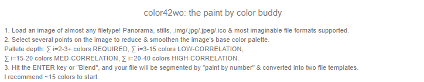
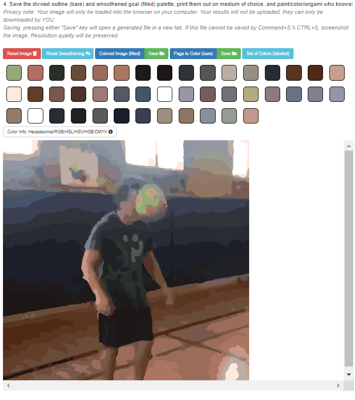
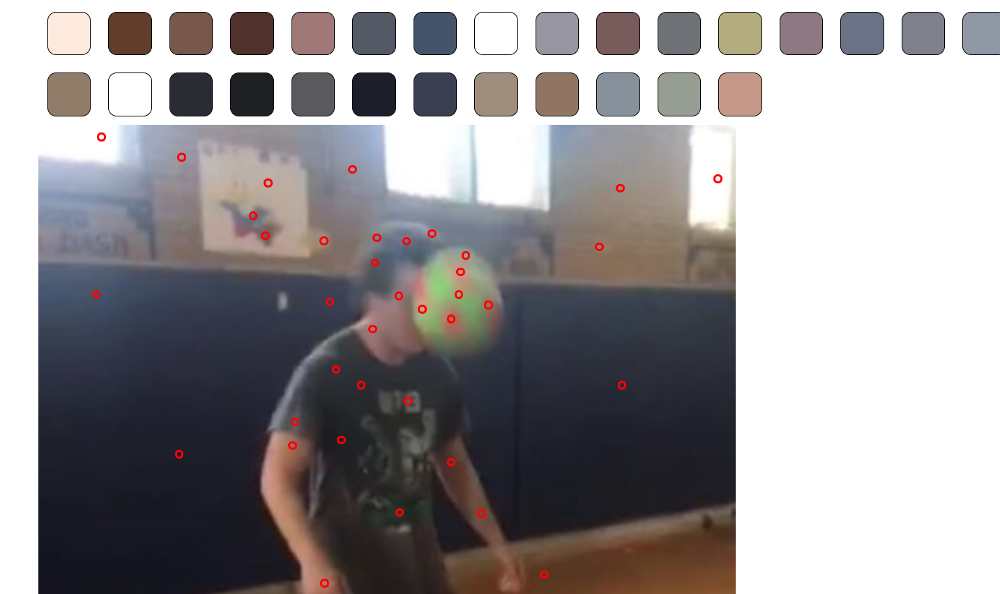

# Image segmentation: Paint/Color by Number

K-means clustering solution to the NP-hard image segmentation "paint by number" technique, where input image's color dimensionality is smoothened, boiling down source coloration clusters most similar to user-selected color regions. By Chase Maivald.

[Demo](https://color42wo.firebaseapp.com/)

## Installation

	git clone https://github.com/chasem51/color42wo.git
	cd color4wo
	firebase login
	firebase serve && firebase deploy

## Credits

- [Angular 1.6.4](https://angularjs.org/)
- [jQuery](https://jquery.com/)
- [bootstrap](https://getbootstrap.com/)
- Image credits: [Chase Maivald](https://www.linkedin.com/in/chase-maivald-8552b5176/)
- References
- [1: Automated Brain Tumor Detection & Segmentation from MRI](https://d1wqtxts1xzle7.cloudfront.net/56966153/IRJET-V5I4562.pdf?1531215183=&response-content-disposition=inline%3B+filename%3DA_Survey_on_Automated_Brain_Tumor_Detect.pdf&Expires=1596177661&Signature=AC17HWSVXwbTwQa~oUA9WvOnPLe95-OCix0u4Aa5Pjy92aP3Le2Ksxg4O0ike4IIbpyF68ArtbKS8GrioJtaBvMpVt8ajOawM7it7HgjdeNqV7d1ikO0AEnJrRZPhBUDCvY-5Zs4odgrn27N9BVu7LTxMzU0wcKenPRD8a5FerD3xW0ooUzVNJI3c9Yw-2AhLtIqQRqbJ76lrANMxXk8iXRBo1uCbaN5zhUrrGZBVYzHSAy4Z4UDOQT8pOqiduYim-qE1XC9pQwjvWFBzmANvfkpOkTcxLuCfPuiXBnqEadPy~G7UWmX8tV78~JwvW6pUi37hbJkmXekMzoZb-HdIw__&Key-Pair-Id=APKAJLOHF5GGSLRBV4ZA)
Shelke, Sanjay M., and Sharad W. Mohod. “Automated Segmentation and Detection of Brain Tumor from MRI.” 2018 International Conference on Advances in Computing, Communications and Informatics (ICACCI), 2018. https://doi.org/10.1109/icacci.2018.8554807.
- [2: Comparitive Study of Data Clustering Techniques](http://www.pami.uwaterloo.ca/pub/hammouda/sde625-paper.pdf) 
Khaled Hammouda, A Comparative study of Data Clustering technique. Department of System Design Engineering, University of Waterloo, Canada.
- [3: Image Segmentation using K-means Clustering Algorithm and Subtractive Clustering Algorithm](https://www.sciencedirect.com/science/article/pii/S1877050915014143)
Aimi Salihai Abdul, Mohd Yusuff Masor and Zeehaida Mohamed , Colour Image Segmentation Approach for Detection of Malaria Parasiter using Various Colour Models and k-Means Clustering, In WSEAS Transaction on Biology and Biomedecine., vol. 10, January (2013).

